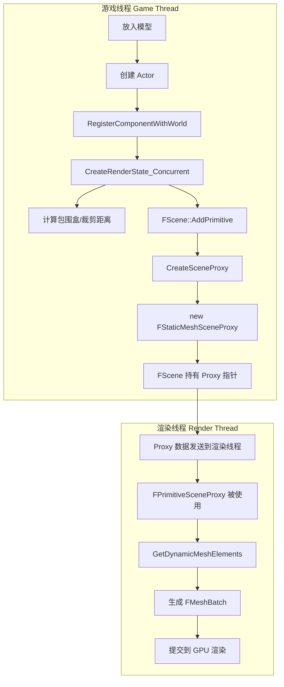

# **关键函数：** 阅读 `FStaticMeshSceneProxy` 的构造函数。

FStaticMeshSceneProxy是由游戏线程中的UStaticMeshComponent拷贝而来，不完全是深拷贝

比如RenderData就是直接获取的指针，直接获取资产里面的RenderData

还有的是复制值到代理类，比如bCastShadow


然后FStaticMeshSceneProxy构造函数里面比较重要的是
-  RenderData
 - LODs 数组构建
 - DistanceField 数据
## RenderData
```
, RenderData(InProxyDesc.GetStaticMesh()->GetRenderData())
```
直接引用==UStaticMeshComponent中的RenderData==来初始化==FStaticMeshSceneProxy==

```
class FStaticMeshRenderData
{
public:
    // ⭐ 核心数据 - 每个 LOD 的渲染资源
    FStaticMeshLODResourcesArray LODResources;  //TArray<FStaticMeshLODResources>
    FStaticMeshVertexFactoriesArray LODVertexFactories;  // 顶点工厂数组
    
    // LOD 切换屏幕尺寸
    FPerPlatformFloat ScreenSize[MAX_STATIC_MESH_LODS];
    
    // Nanite 数据
    TPimplPtr<Nanite::FResources> NaniteResourcesPtr;
    
    // Ray Tracing 数据
    FStaticMeshRayTracingProxy* RayTracingProxy;
    
    // 包围盒
    FBoxSphereBounds Bounds;
    
    ......
};
```
**FStaticMeshRenderData = 顶点 + 索引 + 材质分区（section） + LOD 信息 + Nanite + 距离场，一切渲染需要的数据。**
## LODs 数组构建

```
    for (int32 LODIndex = 0; LODIndex < RenderData->LODResources.Num(); LODIndex++)

    {
		//通过各种数据创建LODInfo，放入LODs末尾(c++语法)
        FLODInfo* NewLODInfo = new (LODs) FLODInfo(InProxyDesc, RenderData->LODVertexFactories, LODIndex, ClampedMinLOD, bLODsShareStaticLighting);

  

        // Under certain error conditions an LOD's material will be set to

        // DefaultMaterial. Ensure our material view relevance is set properly. 
        
        //检测各个lod的section，修复代理的全局属性，并且设置包围盒

        const int32 NumSections = NewLODInfo->Sections.Num();

        for (int32 SectionIndex = 0; SectionIndex < NumSections; ++SectionIndex)

        {

            const FLODInfo::FSectionInfo& SectionInfo = NewLODInfo->Sections[SectionIndex];

            bAnySectionCastsShadows |= RenderData->LODResources[LODIndex].Sections[SectionIndex].bCastShadow;

            if (SectionInfo.Material == UMaterial::GetDefaultMaterial(MD_Surface))

            {

                MaterialRelevance |= UMaterial::GetDefaultMaterial(MD_Surface)->GetRelevance(ShaderPlatform);

            }

  

            MaxWPOExtent = FMath::Max(MaxWPOExtent, SectionInfo.Material->GetMaxWorldPositionOffsetDisplacement());

        }

    }
```
### FLODInfo
```
class FLODInfo : public FLightCacheInterface

{

public:

//═══════════════════════════════════════════════════════════

// 1️⃣ 内嵌结构体：FSectionInfo (每个材质分区的信息)

//═══════════════════════════════════════════════════════════

struct FSectionInfo

{

UMaterialInterface* Material = nullptr; // 材质指针

int32 MaterialIndex = 0; // 材质索引

UMaterialInterface* OverlayMaterial = nullptr; // Overlay 材质

#if WITH_EDITOR

bool bSelected = false; // 编辑器选中状态

HHitProxy* HitProxy = nullptr; // 点击检测代理

#endif

};

//═══════════════════════════════════════════════════════════

// 2️⃣ Section 数组

//═══════════════════════════════════════════════════════════

TArray<FSectionInfo, TInlineAllocator<1>> Sections;

//═══════════════════════════════════════════════════════════

// 3️⃣ 颜色覆盖

//═══════════════════════════════════════════════════════════
//可能是编辑器顶点色绘制也可能是代码生成的颜色
FColorVertexBuffer* OverrideColorVertexBuffer; // 顶点颜色覆盖缓冲区（vbo）

TUniformBufferRef<FLocalVertexFactoryUniformShaderParameters> OverrideColorVFUniformBuffer; // 对应的 Uniform Buffer（vao）

//═══════════════════════════════════════════════════════════

// 4️⃣ 私有成员

//═══════════════════════════════════════════════════════════

private:

TArray<FGuid> IrrelevantLights; // 无关光源列表

bool bUsesMeshModifyingMaterials; // 是否有网格修改材质 (WPO/Tessellation)

//═══════════════════════════════════════════════════════════

// 5️⃣ 继承自 FLightCacheInterface

//═══════════════════════════════════════════════════════════

// (基类提供光照缓存接口)

};
```
**FLODInfo = Section材质信息 + 颜色覆盖 + 光照缓存 + 编辑器支持**
## DistanceField 数据
```
    // Copy the pointer to the volume data, async building of the data may modify the one on FStaticMeshLODResources while we are rendering

    DistanceFieldData = RenderData->LODResources[0].DistanceFieldData;

    CardRepresentationData = RenderData->LODResources[0].CardRepresentationData;

  

    bSupportsDistanceFieldRepresentation = MaterialRelevance.bOpaque && !MaterialRelevance.bUsesSkyMaterial && !MaterialRelevance.bUsesSingleLayerWaterMaterial && DistanceFieldData && DistanceFieldData->IsValid();

    bCastsDynamicIndirectShadow = InProxyDesc.bCastDynamicShadow && InProxyDesc.CastShadow && InProxyDesc.bCastDistanceFieldIndirectShadow && InProxyDesc.Mobility != EComponentMobility::Static && !InProxyDesc.bIsFirstPerson;

    DynamicIndirectShadowMinVisibility = FMath::Clamp(InProxyDesc.DistanceFieldIndirectShadowMinVisibility, 0.0f, 1.0f);

    DistanceFieldSelfShadowBias = FMath::Max(InProxyDesc.bOverrideDistanceFieldSelfShadowBias ? InProxyDesc.DistanceFieldSelfShadowBias : InProxyDesc.GetStaticMesh()->DistanceFieldSelfShadowBias, 0.0f);
```
### 复制距离场数据指针

```
DistanceFieldData = RenderData->LODResources[0].DistanceFieldData;

CardRepresentationData = RenderData->LODResources[0].CardRepresentationData;
```

|变量|数据类型|用途|
|---|---|---|
|```<br>DistanceFieldData<br>```|```<br>FDistanceFieldVolumeData*<br>```|距离场数据 (Lumen GI)|
|```<br>CardRepresentationData<br>```|```<br>FCardRepresentationData*<br>```|卡片表示数据 (Lumen 反射)|

**注意**: 只用 LODResources[0]（最高精度 LOD）的数据

---

### 判断是否支持距离场表示

```
bSupportsDistanceFieldRepresentation = 

    MaterialRelevance.bOpaque                        // 必须是不透明

    && !MaterialRelevance.bUsesSkyMaterial           // 不能是天空材质

    && !MaterialRelevance.bUsesSingleLayerWaterMaterial  // 不能是水材质

    && DistanceFieldData                             // 数据指针不为空

    && DistanceFieldData->IsValid();                 // 数据有效
```

**结果**: 

```
bSupportsDistanceFieldRepresentation = true/false
```

---

### 判断是否投射动态间接阴影

```
bCastsDynamicIndirectShadow = 

    InProxyDesc.bCastDynamicShadow              // 组件设置：投射动态阴影

    && InProxyDesc.CastShadow                   // 组件设置：投射阴影

    && InProxyDesc.bCastDistanceFieldIndirectShadow  // 组件设置：距离场间接阴影

    && InProxyDesc.Mobility != EComponentMobility::Static  // 不是静态物体

    && !InProxyDesc.bIsFirstPerson;             // 不是第一人称物体

```
**结果**: 动态物体是否通过距离场投射软阴影

---

### 间接阴影最小可见度

```
DynamicIndirectShadowMinVisibility = FMath::Clamp(

    InProxyDesc.DistanceFieldIndirectShadowMinVisibility, 

    0.0f, 

    1.0f

);
```

**作用**: 阴影最暗能有多暗 (0.0 = 全黑, 1.0 = 无阴影)

---

### 自阴影偏移
```
DistanceFieldSelfShadowBias = FMath::Max(

    InProxyDesc.bOverrideDistanceFieldSelfShadowBias 

        ? InProxyDesc.DistanceFieldSelfShadowBias           // 使用组件覆盖值

        : InProxyDesc.GetStaticMesh()->DistanceFieldSelfShadowBias,  // 使用 Mesh 默认值

    0.0f  // 最小为 0

);
```

**作用**: 防止物体给自己产生错误阴影（阴影痤疮/漏光）
# LOD 资源如何塞进 FMeshBatch：完整流程分析

- [x] **核心逻辑：** 深入阅读 `GetDynamicMeshElements`。思考它是如何把 LOD 资源塞进 `FMeshBatch` 的。
### 大概流程
GetDynamicMeshElements()
│
├─ 前置检查
│   ├─ bIsLightmapSettingError
│   ├─ bInCollisionView (决定跳过主渲染)
│   └─ bDrawMesh
│
├─ 主渲染 (if EngineShowFlags.StaticMeshes && bDrawMesh)
│   │
│   └─ for each View
│       └─ for each LOD (由 LODMask 决定)
│           │
│           ├─【线框模式分支】
│           │   条件: bIsWireframeView && !Materials && !MeshModifyingMaterials
│           │   调用: GetWireframeMeshElement()
│           │   特点: 合并所有 Section，用统一线框材质
│           │
│           └─【普通模式分支】
│               调用: GetMeshElement() 
│               for each Section:
│                   └─ 填充 FMeshBatch
│                       ├─ 调试材质覆盖（物理遮罩/顶点色）
│                       ├─ 选中状态材质覆盖
│                       └─ 抖动 LOD 处理
│
└─ 碰撞可视化 (#if STATICMESH_ENABLE_DEBUG_RENDERING)
    ├─ 复杂碰撞: GetCollisionMeshElement()
    ├─ 简单碰撞: BodySetup->AggGeom
    ├─ 质量属性
    └─ 边界框
### 数据流
```
RenderData->LODResources[LODIndex]
    ├── Sections[SectionIndex]
    │       ├── FirstIndex      ─┐
    │       ├── NumTriangles    ─┼──► FMeshBatchElement
    │       ├── MinVertexIndex  ─┤
    │       └── MaxVertexIndex  ─┘
    │
    └── IndexBuffer ────────────────► FMeshBatchElement.IndexBuffer

RenderData->LODVertexFactories[LODIndex]
    └── VertexFactory ──────────────► FMeshBatch.VertexFactory

LODs[LODIndex] (FLODInfo)
    ├── Sections[SectionIndex].Material ──► FMeshBatch.MaterialRenderProxy
    └── LightMap/ShadowMap ───────────────► FMeshBatch.LCI
```

### 主渲染
主要就是看这部分，主渲染可以分成四个循环
```
for (View)              // 每个摄像机视角
  for (LOD)             // LODMask 决定渲染哪个 LOD
    for (Section)       // 每个材质槽
      for (Batch)       // 通常为 1
        → GetMeshElement() → Collector.AddMesh()
```
### View
```
for (int32 ViewIndex = 0; ViewIndex < Views.Num(); ViewIndex++)
{
    const FSceneView* View = Views[ViewIndex];
    
    if (IsShown(View) && (VisibilityMap & (1 << ViewIndex)))  // 可见性检查
    {
        FLODMask LODMask = GetLODMask(View);  // 根据视图计算 LOD
```

**作用**：

- Views  包含所有需要渲染的视图（主视口、阴影视图、反射捕获等）
- VisibilityMap 是可见性剔除结果的位图，(1 << ViewIndex) 检查该 Primitive 在这个 View 是否可见
- IsShown(View) ：检查 Actor 的显示/隐藏标志
- GetLODMask(View)：根据视图的位置和投影矩阵，计算应该用哪个 LOD 级别。返回 
	FLODMask，可能包含 1 个 LOD（正常）或 2 个 LOD（抖动过渡时）

### LOD 循环
```
for (int32 LODIndex = 0; LODIndex < RenderData->LODResources.Num(); LODIndex++)
{
    if (LODMask.ContainsLOD(LODIndex) && LODIndex >= ClampedMinLOD)
    {
        const FStaticMeshLODResources& LODModel = RenderData->LODResources[LODIndex];
        const FLODInfo& ProxyLODInfo = LODs[LODIndex];
```

- 遍历所有 LOD 级别（LOD0、LOD1、LOD2...）
- **LODMask.ContainsLOD(LODIndex)**：只渲染 GetLODMask 返回的那个 LOD（抖动时可能是两个）
- **ClampedMinLOD**：Streaming 系统可能还没加载最精细的 LOD，这是当前可用的最小 LOD
- **LODModel**：就是 FStaticMeshLODResources，包含该 LOD 的顶点缓冲、索引缓冲、Section 数组
- **ProxyLODInfo**： FLODInfo，Proxy 缓存的该 LOD 信息，主要是材质、光照贴图、顶点色覆盖

### **Section 和 Batch 循环**
```
for (int32 SectionIndex = 0; SectionIndex < LODModel.Sections.Num(); SectionIndex++)
{
    const int32 NumBatches = GetNumMeshBatches();
    
    for (int32 BatchIndex = 0; BatchIndex < NumBatches; BatchIndex++)
    {
        FMeshBatch& MeshElement = Collector.AllocateMesh();
```
- **Section 循环**：一个 LOD 可以有多个 Section，**每个 Section 对应一个材质槽**。比如一个角色模型：Section 0 是皮肤材质，Section 1 是衣服材质
- **Batch 循环**：   GetNumMeshBatches() 通常返回 1。如果有 GPU 蒙皮（Morph Target 等），可能返回多个
- **Collector.AllocateMesh()**：从 Collector 的内存池分配一个空的 FMeshBatch，避免频繁 new/delete
### **编辑器选中状态**
```
#if WITH_EDITOR
if (GIsEditor)
{
    if (EngineShowFlags.FrontBackFace)
    {
        MeshElement.bDisableBackfaceCulling = true;
    }
    
    const FLODInfo::FSectionInfo& Section = LODs[LODIndex].Sections[SectionIndex];
    bSectionIsSelected = Section.bSelected || (bIsWireframeView && bProxyIsSelected);
    MeshElement.BatchHitProxyId = Section.HitProxy ? Section.HitProxy->Id : FHitProxyId();
}
#endif
```
- **FrontBackFace模式**：关闭背面剔除，可以用于检查模型法线方向
- **bSectionIsSelected：** 在编辑器中选中某个 Section（材质槽）时为 true
- **BatchHitProxyId**：给这个 MeshBatch 分配一个 HitProxy ID。编辑器点击场景时，GPU 渲染一张 ID 图，读取点击位置的 ID 就能知道点了哪个物体的哪个 Section
### **GetMeshElement - 核心填充**
```
if (GetMeshElement(LODIndex, BatchIndex, SectionIndex, SDPG_World, bSectionIsSelected, true, MeshElement))
```
**作用**：把 LOD 资源数据填入 **FMeshBatch**，具体做了：

| 填充内容                                    | 数据来源                                             | 用途                    |
| --------------------------------------- | ------------------------------------------------ | --------------------- |
| ```<br>VertexFactory<br>```             | ```<br>LODVertexFactories[LODIndex]<br>```       | 告诉 GPU 顶点数据在哪里、格式是什么  |
| ```<br>Elements[0].IndexBuffer<br>```   | ```<br>LODResources[LODIndex].IndexBuffer<br>``` | 索引缓冲                  |
| ```<br>Elements[0].FirstIndex<br>```    | ```<br>Section.FirstIndex<br>```                 | 该 Section 在索引缓冲中的起始偏移 |
| ```<br>Elements[0].NumPrimitives<br>``` | ```<br>Section.NumTriangles<br>```               | 要画多少个三角形              |
| ```<br>MaterialRenderProxy<br>```       | ```<br>LODInfo.Sections[i].Material<br>```       | 该 Section 使用的材质       |
| LCI (Light Cache Interface)             | ```<br>&ProxyLODInfo<br>```                      | 光照贴图、阴影贴图             |
| ```<br>LODIndex<br>```                  | 直接赋值                                             | 用于统计、调试               |
| ```<br>CastShadow<br>```                | ```<br>bCastShadow && Section.bCastShadow<br>``` | 该 MeshBatch 是否参与阴影计算  |
### **调试材质覆盖**
```
// 物理材质遮罩可视化
if (bProxyIsSelected && EngineShowFlags.PhysicalMaterialMasks)
{
    MeshElement.MaterialRenderProxy = PhysMatMaskVisualizationMaterialInstance;
}

// 顶点色可视化
if (bProxyIsSelected && EngineShowFlags.VertexColors)
{
    MeshElement.MaterialRenderProxy = VertexColorVisualizationMaterialInstance;
}

// Section 选中高亮
if (bSectionIsSelected)
{
    MeshElement.MaterialRenderProxy = new FOverrideSelectionColorMaterialRenderProxy(...);
}
```
- 如果开启了调试视图模式，**替换掉原本的材质**，改成调试用材质
- 物理材质遮罩：显示物理材质 Mask 贴图
- 顶点色：显示模型的顶点色数据
- 选中高亮：编辑器中选中 Section 时，用橙色高亮替换材质
### **抖动 LOD 处理**
```
if (MeshElement.bDitheredLODTransition && LODMask.IsDithered())
{
    // 保持 true
}
else
{
    MeshElement.bDitheredLODTransition = false;
}
```
- **抖动 LOD 过渡**：当物体从 LOD0 切换到 LOD1 时，不是瞬间切换，而是两个 LOD 同时渲染，用抖动图案混合（像棋盘格一样交错）
- **LODMask.IsDithered()：** GetLODMask 计算出需要抖动过渡
- **bDitheredLODTransition = true** 时，Shader 会根据屏幕位置决定显示哪个 LOD 的像素

### **提交到 Collector**
```
MeshElement.bCanApplyViewModeOverrides = true;
MeshElement.bUseWireframeSelectionColoring = bSectionIsSelected;

Collector.AddMesh(ViewIndex, MeshElement);
INC_DWORD_STAT_BY(STAT_StaticMeshTriangles, MeshElement.GetNumPrimitives());
```

- **bCanApplyViewModeOverrides = true**：允许引擎后续阶段（MeshProcessor）应用视图模式覆盖（比如 Lit/Unlit/Detail Lighting 切换）
- **bUseWireframeSelectionColoring**：选中时，线框颜色会变成选中色
- **Collector.AddMesh(ViewIndex, MeshElement)** : 最终提交！把这个**FMeshBatch**放入 Collector 关联到指定 **View**
- 累加统计三角形数量用于 Stat 显示
## 最终：一个 Section 产生一个 FMeshBatch

       ┌─────────────────────────────────────────────────────────┐
       │ RenderData->LODResources[LODIndex]                      │
       │     ├── Sections[0] ──► FMeshBatch #1 (材质A)            │
       │     ├── Sections[1] ──► FMeshBatch #2 (材质B)            │
       │     └── Sections[2] ──► FMeshBatch #3 (材质C)            │
       │                                                         │
       │ 每个 FMeshBatch 包含：                                   │
       │     - VertexFactory (顶点数据在哪)                       │
       │     - IndexBuffer + FirstIndex + NumTriangles (画哪些面)  │
       │     - MaterialRenderProxy (用什么材质)                   │
       │     - LCI (光照贴图)                                     │
       └─────────────────────────────────────────────────────────┘


 # **断点追踪：** 在 `FScene::AddPrimitive` 打断点，拖入一个 Cube，观察 Call Stack，理解 Proxy 是何时被创建的。

### 栈堆
从placeasset面板加入模型的栈堆调用
![[资源图片/addprimitive栈堆.png]]

## 调用流程
```
📍 用户操作入口
UPlacementSubsystem::PlaceAsset()               ← Place Actors 拖入
    ↓
UPlacementSubsystem::PlaceAssets()
    ↓
UActorComponent::RegisterComponentWithWorld()   ← 组件注册到世界
    ↓
UActorComponent::ExecuteRegisterEvents()
    ↓
UStaticMeshComponent::CreateRenderState_Concurrent()
    ↓
UPrimitiveComponent::CreateRenderState_Concurrent()
    ↓
FScene::AddPrimitive()                          ← 添加到渲染场景
    ↓
FScene::BatchAddPrimitivesInternal()            ← 批量处理优化
    ↓
FActorPrimitiveInterface::CreateSceneProxy()    ← 开始创建 Proxy
	|
	|UPrimitiveComponent::CreateSceneProxy()    ← 使用接口做了包装做了其他处理
	|                                             然后通过宏得到实际的组件进行调用
	|                                            
    ↓
UStaticMeshComponent::CreateSceneProxy() ← 派生类重写（虚函数分发到这里）
	↓
FStaticMeshComponentHelper::CreateSceneProxy()
    ↓
UStaticMeshComponent::CreateStaticMeshSceneProxy()
    ↓
🎯 FStaticMeshSceneProxy::FStaticMeshSceneProxy()  ← 构造函数（断点位置）
```
## 继承链
```
UObject
    └── UActorComponent                    ← 所有组件的基类
            └── USceneComponent            ← 有变换（位置/旋转/缩放）
                    └── UPrimitiveComponent    ← 可渲染 + 可碰撞
                            └── UMeshComponent         ← 网格相关
                                    └── UStaticMeshComponent   ← 静态网格
```

| 问题                | 答案                                                                            |     |     |
| ----------------- | ----------------------------------------------------------------------------- | --- | --- |
| **Proxy 什么时候创建？** | 组件注册到世界时（<br><br>```<br>RegisterComponentWithWorld<br>```<br><br>）            |     |     |
| **在哪里创建？**        | ```<br>AddPrimitive<br>```<br><br> → <br><br>```<br>CreateSceneProxy()<br>``` |     |     |
| **谁决定创建什么类型？**    | 组件的虚函数 <br><br>```<br>CreateSceneProxy()<br>```                               |     |     |
| **创建后存在多久？**      | 直到组件被 Unregister 或主动销毁                                                        |     |     |
| **我要自定义怎么办？**     | 重写 <br><br>```<br>CreateSceneProxy()<br>```<br><br>，返回自定义 Proxy               |     |     |
## 流程图



## 总结

当**拖入模型到编辑器**里面的时候，触发组件注册到世界时， **CreateRenderState_Concurrent** 会调用 **AddPrimitive** ，在其内部通过 **CreateSceneProxy** 创建 **FPrimitiveSceneProxy**，供渲染线程使用来生成 **FMeshBatch** 并提交 GPU 绘制。

简单来说就是
**组件注册 → 创建渲染状态 → AddPrimitive → CreateSceneProxy → 渲染线程用 Proxy 生成 MeshBatch → GPU 绘制。**


当 **UStaticMeshComponent**（或其他 **UPrimitiveComponent** **子类**）注册到世界时，会触发 **CreateRenderState_Concurrent**（**设置改组件的渲染状态**） ，在其中调用 **FScene::AddPrimitive 把自己添加到渲染场景**，并通过 **CreateSceneProxy 创建对应的 FStaticMeshSceneProxy（渲染代理）**，供渲染线程使用。

## "渲染状态" 包含什么

| 内容                                                           | 在哪里设置                                                                  |
| ------------------------------------------------------------ | ---------------------------------------------------------------------- |
| **<br><br>```<br>bRenderStateCreated = true<br>```<br><br>** | 父类 <br><br>```<br>UActorComponent::CreateRenderState_Concurrent<br>``` |
| **包围盒 Bounds**                                               | UpdateBounds()                                                         |
| **裁剪距离**                                                     | CachedMaxDrawDistance                                                  |
| **场景注册**                                                     | AddPrimitive()                                                         |
| **SceneProxy 对象**                                            | CreateSceneProxy()                                                     |
**UStaticMeshComponent** 在注册时，通过 **CreateRenderState_Concurrent** 创建渲染状态（包围盒、裁剪距离、SceneProxy 等），并通过 **AddPrimitive** 将自身添加到 FScene。


## 💻 实战任务：数据劫持 (Coding Tasks)