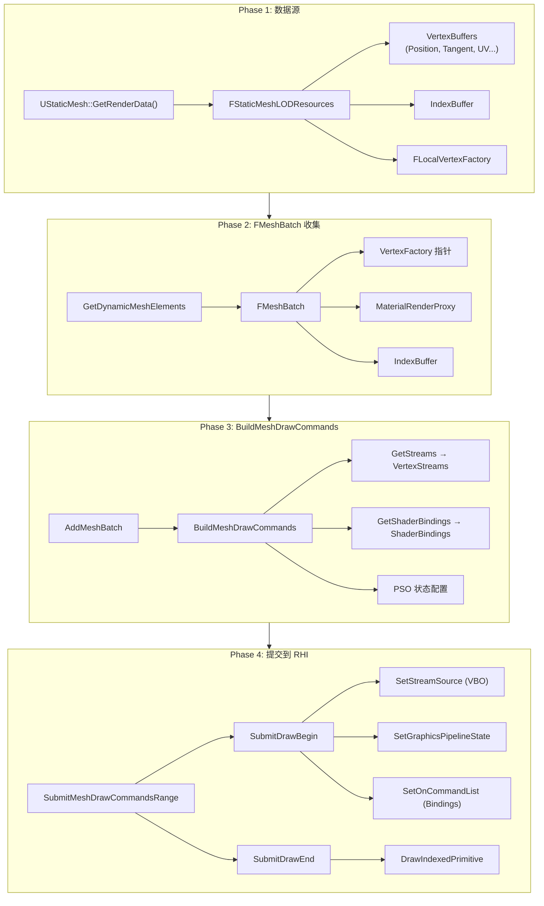
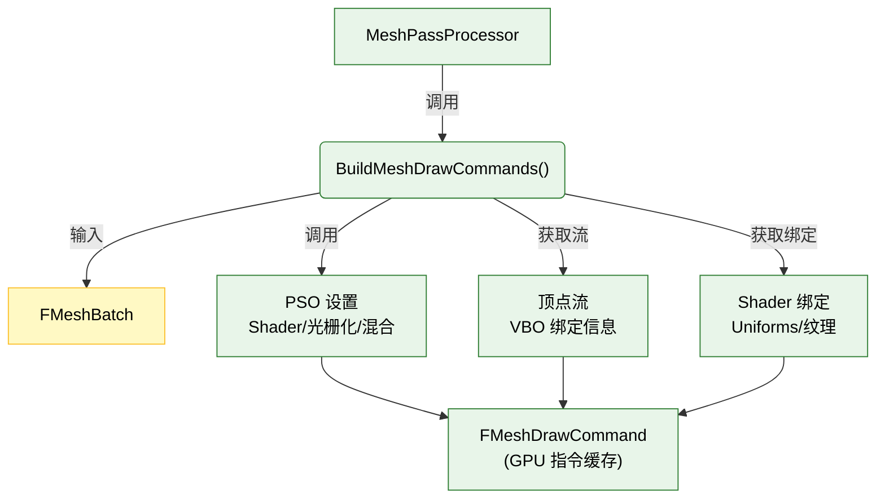
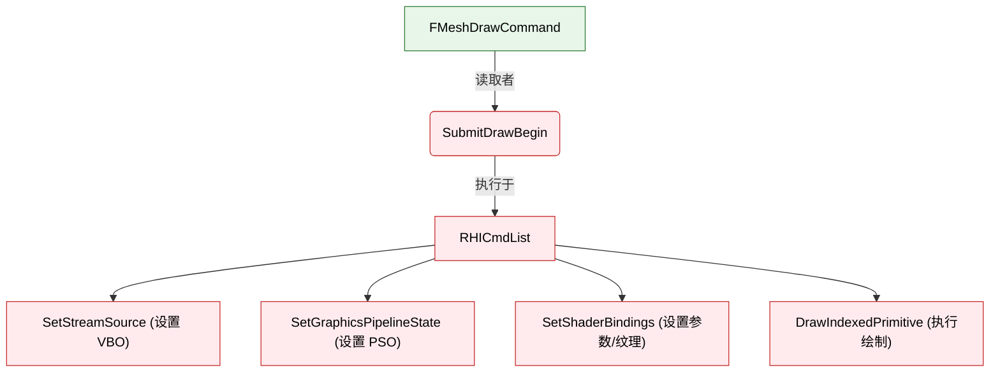
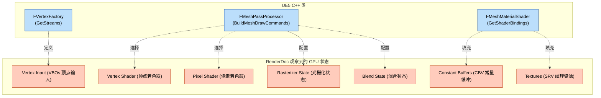
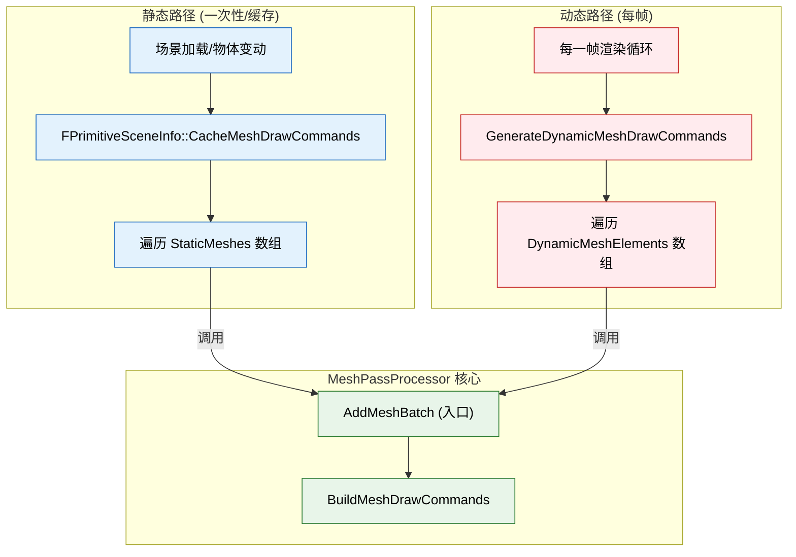

目标： 介入渲染管线的“决策层”，控制“画什么”和“怎么画”。
# 学习
## 查看BasePassRendering.cpp

- [x] **死磕核心：** 阅读 `Engine/Source/Runtime/Renderer/Private/BasePassRendering.cpp`。
    
	- [x] **搜索关键词：** `AddMeshBatch`。这是所有不透明物体渲染逻辑的入口。


## 第一层：材质解析
核心函数==AddMeshBatch==
```
void FBasePassMeshProcessor::AddMeshBatch(...)
{
    if (MeshBatch.bUseForMaterial)  // ① 检查 MeshBatch 是否用于材质渲染
    {
        const FMaterialRenderProxy* MaterialRenderProxy = MeshBatch.MaterialRenderProxy;
        while (MaterialRenderProxy)  // ② 材质降级循环 (Fallback)
        {
            const FMaterial* Material = MaterialRenderProxy->GetMaterialNoFallback(FeatureLevel);
            if (Material && Material->GetRenderingThreadShaderMap())  // ③ 材质合法 + Shader 已编译
            {
                if (TryAddMeshBatch(...))  // ④ 进入第二层
                    break;
            }
            MaterialRenderProxy = MaterialRenderProxy->GetFallback(FeatureLevel);  // ⑤ 拿不到就降级
        }
    }
}
```
**关键决策**：材质有 Fallback 链，如果你的自定义材质 Shader 没编译好，它会自动降级到默认材质。

## 第二层：混合模式过滤
核心函数==TryAddMeshBatch==
bool FBasePassMeshProcessor::TryAddMeshBatch(...)
{
    const EBlendMode BlendMode = Material.GetBlendMode();
    const bool bIsTranslucent = IsTranslucentBlendMode(BlendMode);
    
    // ShouldDraw 的核心逻辑:
    // - 如果是 bTranslucentBasePass → 只画对应半透明子 Pass 的
    // - 如果不是 → bShouldDraw = !bIsTranslucent (只画不透明的！)
    
    if (bShouldDraw
        && PrimitiveSceneProxy->ShouldRenderInMainPass()  // Proxy 是否参与主 Pass
        && ShouldIncludeDomainInMeshPass(Material)        // 材质 Domain 检查
        && ShouldIncludeMaterialInDefaultOpaquePass(Material))  // 默认 Opaque Pass 检查
    {
        // → 进入第三层
    }
}
## 第三层：光照策略选择 + 调用 Process
### 好的，第三层代码在 ==TryAddMeshBatch==，以下是带注释的完整逻辑：
```
// === 第三层：光照策略选择 + 调用 Process (L2217-2325) ===
// 前面两层过滤都通过了，现在决定"怎么画" —— 选光照策略

// ① 先判断：是不是 "有光照 + 半透明 + 能投体积自阴影" 的特殊情况
if (bIsLitMaterial
    && bIsTranslucent
    && PrimitiveSceneProxy
    && PrimitiveSceneProxy->CastsVolumetricTranslucentShadow())
{
    // 特殊路径：半透明自阴影，再细分三种 Policy
    
    if (bUseVolumetricLightmap && bAllowStaticLighting)
    {
        // 情况A: 用体积光照贴图 + 自阴影
        Process<FSelfShadowedVolumetricLightmapPolicy>(...);
    }
    else if (IsIndirectLightingCacheAllowed() && bAllowIndirectLightingCache)
    {
        // 情况B: 用间接光照缓存 + 自阴影
        Process<FSelfShadowedCachedPointIndirectLightingPolicy>(...);
    }
    else
    {
        // 情况C: 普通自阴影半透明
        Process<FSelfShadowedTranslucencyPolicy>(...);
    }
}
else
{
    // ② 常规路径（90%+ 的物体走这里）
    //    通过 GetUniformLightMapPolicyType 选择光照贴图策略
    ELightMapPolicyType UniformLightMapPolicyType = 
        GetUniformLightMapPolicyType(FeatureLevel, Scene, MeshBatch.LCI, 
                                      PrimitiveSceneProxy, Material);
    
    // 选出来的 Policy 可能是:
    //   LMP_HQ_LIGHTMAP                              → 高质量光照贴图
    //   LMP_LQ_LIGHTMAP                              → 低质量光照贴图
    //   LMP_DISTANCE_FIELD_SHADOWS_AND_HQ_LIGHTMAP   → 距离场阴影 + HQ
    //   LMP_PRECOMPUTED_IRRADIANCE_VOLUME            → 预计算辐照度体积
    //   LMP_CACHED_VOLUME_INDIRECT_LIGHTING          → 缓存体积间接光
    //   LMP_CACHED_POINT_INDIRECT_LIGHTING           → 缓存点间接光
    //   LMP_NO_LIGHTMAP                              → 无光照贴图
    
    Process<FUniformLightMapPolicy>(
        MeshBatch,
        BatchElementMask,
        StaticMeshId,
        PrimitiveSceneProxy,
        MaterialRenderProxy,
        Material,
        bIsMasked,
        bIsTranslucent,
        ShadingModels,
        FUniformLightMapPolicy(UniformLightMapPolicyType),  // ← 策略注入
        MeshBatch.LCI,        // ← 光照缓存接口
        MeshFillMode,
        MeshCullMode);
}
```
### ==Process== 内部做的事
调用==BuildMeshDrawCommands==
```
template<typename LightMapPolicyType>
bool FBasePassMeshProcessor::Process(...)
{
    // 1 根据 Material + VertexFactory + LightMapPolicy 获取 Shader
    TMeshProcessorShaders<VS, PS> BasePassShaders;
    if (!GetBasePassShaders<LightMapPolicyType>(
            MaterialResource,
            VertexFactory->GetType(),
            LightMapPolicy,          // ← 上一步选出的光照策略
            FeatureLevel,
            bRenderSkylight,
            &BasePassShaders.VertexShader,    // ← 输出: 选好的 VS
            &BasePassShaders.PixelShader))    // ← 输出: 选好的 PS
    {
        return false;  // Shader 编译失败 → 放弃
    }

    // 2 配置渲染状态
    FMeshPassProcessorRenderState DrawRenderState(PassDrawRenderState);
    SetDepthStencilStateForBasePass(DrawRenderState, ...);  // 深度/模板
    // 如果是半透明，还要设置半透明混合状态
    if (bTranslucentBasePass)
        SetTranslucentRenderState(DrawRenderState, ...);

    // 3 计算排序键（决定绘制顺序）
    FMeshDrawCommandSortKey SortKey;
    if (bTranslucentBasePass)
        SortKey = CalculateTranslucentMeshStaticSortKey(...);  // 半透明: 按距离排
    else
        SortKey = CalculateBasePassMeshStaticSortKey(          // 不透明: 按材质/Shader 排
            EarlyZPassMode, bIsMasked, VS, PS);

    // 4 最终调用！把所有决策结果交给 BuildMeshDrawCommands
    BuildMeshDrawCommands(
        MeshBatch,
        BatchElementMask,
        PrimitiveSceneProxy,
        MaterialRenderProxy,
        MaterialResource,
        DrawRenderState,        // ← PSO 状态 (深度/混合/模板)
        BasePassShaders,        // ← 选好的 VS + PS
        MeshFillMode,           // ← 实体/线框
        MeshCullMode,           // ← 背面剔除
        SortKey,                // ← 绘制排序键
        EMeshPassFeatures::Default,
        ShaderElementData);     // ← 光照贴图数据
    
    return true;
}
```
## **RenderDoc 逆向：**
- [x] **RenderDoc 逆向：** 截帧查看 Mesh 的 `Vertex Attributes`，回到源码寻找 `FMeshDrawCommand` 是在哪填充这些 Stream 的。
截帧查看 Mesh 的 **`Vertex Attributes`**，回到源码寻找 **`FMeshDrawCommand`** 是在哪填充这些 Stream 的。
## 将MeshBatch处理成MeshDrawCommands的流程

```
// 在你的 FDistortionPassMeshProcessor::AddMeshBatch 中
void FDistortionPassMeshProcessor::AddMeshBatch(...)
{
    // 1. "画什么" - 过滤逻辑（你已经做了）
    if (!ShouldRenderInDistortionField(PrimitiveSceneProxy))
        return;
    
    // 2. "怎么画" - 调用 BuildMeshDrawCommands
    //    现在你理解了这个函数内部：
    //    - 从 VertexFactory 拿 VertexStreams
    //    - 绑定你的自定义 Shader
    //    - 设置你的 Distortion 效果参数
    BuildMeshDrawCommands(
        MeshBatch,
        BatchElementMask,
        PrimitiveSceneProxy,
        MaterialRenderProxy,
        MaterialResource,
        PassDrawRenderState,
        DistortionPassShaders,  // 你的自定义 Shader
        MeshFillMode,
        MeshCullMode,
        SortKey,
        EMeshPassFeatures::Default,
        ShaderElementData  // 可以传自定义数据给 Shader
    );
}
```
## 立方体的drawcall
![[Pasted image 20260126205004.png]]
![[Pasted image 20260126204939.png]]

### input aseembler
![[Pasted image 20260126204927.png]]
### Input Layout
![[Pasted image 20260126205624.png]]
#### PER_VERTEX 和 PER_INSTANCE
可以看到有两个槽位的数据

| 字段             | Slot 0 值        | Slot 10 值    | 含义                                                                                                      |
| -------------- | --------------- | ------------ | ------------------------------------------------------------------------------------------------------- |
| **Slot**       | 0               | 10           | 属性编号 (对应 Shader 中的 <br><br>```<br>ATTRIBUTE0<br>```<br><br>, <br><br>```<br>ATTRIBUTE10<br>```<br><br>) |
| **Semantic**   | ATTRIBUTE       | ATTRIBUTE    | 语义名 (D3D 用，Vulkan/OpenGL 通常都是 ATTRIBUTE)                                                                |
| **Index**      | 0               | 13           | 语义索引                                                                                                    |
| **Format**     | R32G32B32_FLOAT | R32_UINT     | 数据格式：float3 (12 bytes) / uint (4 bytes)                                                                 |
| **Input Slot** | 0               | 5            | 🔴 绑定到哪个 **Buffer Slot**                                                                                |
| **Offset**     | 0               | 0            | 在 Buffer 中的起始偏移                                                                                         |
| **Class**      | PER_VERTEX      | PER_INSTANCE | 🔵 每顶点读取 / 每实例读取                                                                                        |
| **Step Rate**  | -               | 1            | PER_INSTANCE 时，每 N 个实例更新一次                                                                              |
里面有语义，对应的buffer槽位，数据类型等等

### Buffer
![[Pasted image 20260126205637.png]]

从截图中看到 3 个 Buffer：

| Slot      | Buffer 名称                   | Stride | Offset  | Byte Length | 含义                          |     |
| --------- | --------------------------- | ------ | ------- | ----------- | --------------------------- | --- |
| **Index** | Resource PoolAllocator...   | 2      | 9656579 | 90          | 索引缓冲区 (EBO), 45 个 uint16 索引 |     |
| **0**     | Resource PoolAllocator...   | 12     | 9657344 | 288         | 位置 VBO, 24 个 float3 顶点      |     |
| **5**     | InstanceCulling.Instance... | 0      | 28      | 65508       | 实例 ID 偏移缓冲区                 |     |
##### InstanceIdOffsetBuffer实际读取GPUScene数据
```
InstanceIdOffsetBuffer = [0, 1, 2, 3, ..., 99]
                          │  │  │
                          │  │  └── 实例2 → 读取 GPU Scene[2]
                          │  └───── 实例1 → 读取 GPU Scene[1]
                          └──────── 实例0 → 读取 GPU Scene[0]
```
### **GPUScene**

GPU Scene Instance Data[N]:
├── LocalToWorld (float4x4)      ← Transform 矩阵
├── PrevLocalToWorld (float4x4)  ← 上一帧 Transform (用于 Motion Blur)
├── LocalBounds (float4)         ← 包围盒
├── CustomPrimitiveData          ← 自定义数据 (材质参数等)
├── LightmapUVBias               ← 光照贴图 UV 偏移
├── ... 更多属性


### Draw Call 完整流程
**场景**: 绘制 100 个椅子实例
```
for each Instance (0..99):// ← 实际上是 GPU 并行处理所有实例

① 从 InstanceIdOffsetBuffer[InstanceID] 获取 GPU Scene 偏移

uint offset = InstanceIdOffsetBuffer[InstanceID];

② 从 GPU Scene 读取这个实例的所有数据

InstanceData data = GPUScene[offset];

float4x4 WorldMatrix = data.LocalToWorld;

float4 CustomData = data.CustomPrimitiveData;

③ 遍历 EBO 中的索引，绘制每个三角形

for each triangle in EBO:

for each vertex (idx0, idx1, idx2):

④ 从 VBO 读取顶点的本地坐标

float3 LocalPos = PositionVBO[idx];

⑤ 用实例的 Transform 变换到世界空间

float3 WorldPos = LocalPos * WorldMatrix;

⑥ 输出到光栅化
```


## RenderDoc ↔ CPU 代码完整对应关系

本笔记记录 RenderDoc 截帧看到的 GPU 数据如何对应到 UE5 CPU 端源代码，并附带简要功能说明。

---

## 1. Vertex Input (VBO 绑定)

**核心功能**：告诉 GPU 顶点数据（位置、UV、法线等）存放在哪块显存，以及如何读取。

| RenderDoc 看到的       | CPU 代码位置                                | 功能简述                                  |
| ------------------- | --------------------------------------- | ------------------------------------- |
| VBO Slot 0,1,2,3... | FVertexFactory::GetStreams              | **配置数据流**：决定当前 Mesh 需要用到哪些顶点缓冲区（VBO）。 |
| VertexBuffer RHI 资源 | FVertexInputStream::SetOnRHICommandList | **绑定显存**：将具体的 VBO 资源句柄绑定到 GPU 的指定槽位。  |
| Stride / Offset     | FVertexStream 中的 `Stream.Offset`        | **数据偏移**：告诉 GPU 从 VBO 的哪个字节位置开始读取数据。  |

### 关键代码片段

```
// VertexFactory.cpp:256-288

void FVertexFactory::GetStreams(...) const

{

    // 遍历所有流，收集 VBO 和偏移信息，准备绑定

    for (int32 StreamIndex = 0; StreamIndex < Streams.Num(); StreamIndex++)

    {

        const FVertexStream& Stream = Streams[StreamIndex];

        OutVertexStreams.Add(FVertexInputStream(StreamIndex, Stream.Offset, 

                                                Stream.VertexBuffer->VertexBufferRHI));

    }

}
```

---

## 2. Pipeline State (PSO)

**核心功能**：配置光栅化管线状态，决定三角形如何被绘制、着色和混合。

|RenderDoc 看到的|CPU 代码位置|功能简述|
|---|---|---|
|Vertex/Pixel Shader|BuildMeshDrawCommands - SetupBoundShaderState|**绑定 Shader**：设置当前使用的顶点与像素着色器程序。|
|RasterizerState|BuildMeshDrawCommands - GetStaticRasterizerState|**光栅化设置**：控制背面剔除（Cull Mode）和填充模式（实体/线框）。|
|BlendState|BuildMeshDrawCommands - GetBlendState|**混合模式**：控制像素如何与背景混合（如透明度叠加）。|
|DepthStencilState|BuildMeshDrawCommands - GetDepthStencilState|**深度测试**：控制 Z-Buffer 读写，决定遮挡关系。|
|VertexDeclaration (Input Layout)|BuildMeshDrawCommands - GetDeclaration|**数据格式**：定义顶点数据的布局（如：Float3 位置 + Byte4 颜色）。|

### 关键代码片段

```
// MeshPassProcessor.inl:83-108

// 设置 PSO 状态

PipelineState.SetupBoundShaderState(VertexDeclaration, MeshProcessorShaders); // Shader + Input Layout

PipelineState.RasterizerState = GetStaticRasterizerState<true>(MeshFillMode, MeshCullMode); // 剔除

PipelineState.BlendState = DrawRenderState.GetBlendState();       // 混合

PipelineState.DepthStencilState = DrawRenderState.GetDepthStencilState(); // 深度

---
```

## 3. Shader Bindings (Uniform/Texture/Sampler)

**核心功能**：给 Shader 提供运行时参数（位置、颜色、纹理贴图）。

| RenderDoc 看到的              | CPU 代码位置                                  | 功能简述                                                            |
| -------------------------- | ----------------------------------------- | --------------------------------------------------------------- |
| CBV (Constant Buffer)      | BuildMeshDrawCommands - GetShaderBindings | **常量参数**：收集 Shader 需要的 Uniform 变量（如 ObjectPosition, BaseColor）。 |
| SRV (Shader Resource View) | 同上，在 `ShaderBindings` 中                   | **纹理资源**：收集 Shader 需要采样的纹理贴图。                                   |
| Sampler                    | 同上，在 `ShaderBindings` 中                   | **采样器**：定义纹理的过滤方式（如 Linear/Nearest）和寻址模式（Wrap/Clamp）。           |

### 关键代码片段

```
// MeshPassProcessor.inl:136-152

// 让 Shader 从 Scene、Proxy 和 Material 中获取它需要的具体数据绑定

PassShaders.VertexShader->GetShaderBindings(Scene, FeatureLevel, PrimitiveSceneProxy, 

                                             MaterialRenderProxy, MaterialResource, 

                                             ShaderElementData, ShaderBindings);
```

---

## 4. Draw Call 提交流程

**核心功能**：将准备好的命令发送给 GPU 执行绘制。

|RenderDoc 看到的|CPU 代码位置|功能简述|
|---|---|---|
|SetStreamSource|SubmitDrawBegin - SetStreamSource|**设置顶点源**：底层 API 调用，应用 VBO 绑定。|
|SetGraphicsPipelineState|SubmitDrawBegin - SetGraphicsPipelineStateCheckApply|**设置管线**：底层 API 调用，应用 PSO（Shader 和渲染状态）。|
|SetShaderBindings|SubmitDrawBegin - SetOnCommandList|**应用参数**：底层 API 调用，将参数和纹理表提交到 GPU。|
|DrawIndexedPrimitive|SubmitDrawEnd - DrawIndexedPrimitive|**绘制指令**：最终命令，让 GPU 根据索引缓冲区绘制三角形。|

### 关键代码片段

```
// MeshPassProcessor.cpp:1281-1297 (SubmitDrawBegin)

Stream.SetOnRHICommandList(RHICmdList);  // RHI: 绑定 VBO

// MeshPassProcessor.cpp:1320-1328 (SubmitDrawEnd)

RHICmdList.DrawIndexedPrimitive(MeshDrawCommand.IndexBuffer, ...); // RHI: 开始绘制
```

---

## 5. 完整调用链路


---

## 6.  指令构建 (工作线程)
此阶段展示 **`MeshPassProcessor`** 如何将 **`FMeshBatch`** 转换为 GPU 可识别的 

FMeshDrawCommand。

## 7: 提交 (RHI 线程)
此阶段展示 RHI 线程如何执行最终的 GPU 指令

## 8. RenderDoc 组件映射图
此图展示 RenderDoc 中观察到的 GPU 状态是由哪些 C++ 类负责管理的。


## 关键函数解析
### 1. Vertex Input (VBO / 顶点输入)

- **负责人**: `FVertexFactory::GetStreams`
- **动作**: 遍历流并创建 `FVertexInputStream` 条目。
- **结果**: 告诉 GPU “数据流 0 位在这个缓冲区的 0 偏移处”。

### 2. Pipeline State (PSO / 管线状态)

- **负责人**: `FMeshPassProcessor::BuildMeshDrawCommands`
- **动作**: 调用 `SetupBoundShaderState` 并设置 `RasterizerState` (光栅化), `BlendState` (混合)。
- **结果**: 编译“如何绘制”的状态对象 (Shader 程序 + 固定管线设置)。

### 3. Shader Bindings (着色器绑定)

- **负责人**: `FMeshPassProcessor` -> `GetShaderBindings`
- **动作**: 从 
    
    Scene (场景), 
    
    View (视图), 和 
    
    Material (材质) 中拉取数据来填充 Uniform Buffers (常量缓冲区)。
- **结果**: 提供“用什么数据绘制” (颜色, 变换矩阵, 纹理 ID)。

### 4. 补充深挖：FMeshBatch 如何进入 MeshPassProcessor？

很多开发者会好奇，`GetDynamicMeshElements` 只是生成了 `FMeshBatch`，是谁把它“喂”给 `MeshPassProcessor` 处理的？答案是由两个不同的路径汇聚到同一个入口函数 `AddMeshBatch`。

#### 核心机制

无论静态还是动态物体，最终都会调用 `FMeshPassProcessor::AddMeshBatch` 函数。

1. **静态路径 (Static Path)**
    
    - **时机**: 场景加载或物体变动时 (Cache Update)。
    - **函数**: `FPrimitiveSceneInfo::CacheMeshDrawCommands` (在 
        
        PrimitiveSceneInfo.cpp)。
    - **流程**: 它遍历所有 
        
        StaticMeshes，创建对应的 Processor，然后循环调用 `AddMeshBatch`。
2. **动态路径 (Dynamic Path)**
    
    - **时机**: 每一帧 (Per Frame)。
    - **函数**: 
        
        GenerateDynamicMeshDrawCommands (在 
        
        MeshDrawCommands.cpp)。
    - **流程**: 它遍历每一帧收集到的 `DynamicMeshElements`，然后循环调用 `AddMeshBatch`。

#### 流程图解



# 实际操作
## 💻 实战任务：自定义 Processor (Coding Tasks)
### 注册Pass

#### **注册 Pass：** 在 `MeshPassProcessor.h` (或你的模块) 中注册一个新的 `EMeshPass::Type`，命名为 `DistortionPass`。

##### **改动1**：添加EMeshPass枚举==RealityDistortion==
```
namespace EMeshPass

{

    enum Type : uint8

    {

        DepthPass,

        SecondStageDepthPass,

        BasePass,

        AnisotropyPass,

        SkyPass,

        SingleLayerWaterPass,

        SingleLayerWaterDepthPrepass,

        CSMShadowDepth,

        VSMShadowDepth,

        OnePassPointLightShadowDepth,

        Distortion,

        Velocity,

        TranslucentVelocity,

        TranslucentVelocityClippedDepth, /**  A pass to handle pixels with depth below the opaque threshold*/

        TranslucencyStandard,

        TranslucencyStandardModulate,

        TranslucencyAfterDOF,

        TranslucencyAfterDOFModulate,

        TranslucencyAfterMotionBlur,

        TranslucencyHoldout, /** A standalone pass to render all translucency for holdout, inferring the background visibility*/

        TranslucencyAll, /** Drawing all translucency, regardless of separate or standard.  Used when drawing translucency outside of the main renderer, eg FRendererModule::DrawTile. */

        LightmapDensity,

        DebugViewMode, /** Any of EDebugViewShaderMode */

        CustomDepth,

        MobileBasePassCSM,  /** Mobile base pass with CSM shading enabled */

        VirtualTexture,

        LumenCardCapture,

        LumenCardNanite,

        LumenTranslucencyRadianceCacheMark,

        LumenFrontLayerTranslucencyGBuffer,

        DitheredLODFadingOutMaskPass, /** A mini depth pass used to mark pixels with dithered LOD fading out. Currently only used by ray tracing shadows. */

        NaniteMeshPass,

        MeshDecal_DBuffer,

        MeshDecal_SceneColorAndGBuffer,

        MeshDecal_SceneColorAndGBufferNoNormal,

        MeshDecal_SceneColor,

        MeshDecal_AmbientOcclusion,

        WaterInfoTextureDepthPass,

        WaterInfoTexturePass,

        RealityDistortion,

  

#if WITH_EDITOR

        HitProxy,

        HitProxyOpaqueOnly,

        EditorLevelInstance,

        EditorSelection,

#endif

  

        Num,

        NumBits = 6,

    };

}
```
##### **改动 2** — 在 ==GetMeshPassName== 的 switch 中添加 case：
添加case EMeshPass::RealityDistortion: return TEXT("RealityDistortion");

```
inline const TCHAR* GetMeshPassName(EMeshPass::Type MeshPass)

{

    switch (MeshPass)

    {

    case EMeshPass::DepthPass: return TEXT("DepthPass");

    case EMeshPass::SecondStageDepthPass: return TEXT("SecondStageDepthPass");

    case EMeshPass::BasePass: return TEXT("BasePass");

    case EMeshPass::AnisotropyPass: return TEXT("AnisotropyPass");

    case EMeshPass::SkyPass: return TEXT("SkyPass");

    case EMeshPass::SingleLayerWaterPass: return TEXT("SingleLayerWaterPass");

    case EMeshPass::SingleLayerWaterDepthPrepass: return TEXT("SingleLayerWaterDepthPrepass");

    case EMeshPass::CSMShadowDepth: return TEXT("CSMShadowDepth");

    case EMeshPass::VSMShadowDepth: return TEXT("VSMShadowDepth");

    case EMeshPass::OnePassPointLightShadowDepth: return TEXT("OnePassPointLightShadowDepth");

    case EMeshPass::Distortion: return TEXT("Distortion");

    case EMeshPass::Velocity: return TEXT("Velocity");

    case EMeshPass::TranslucentVelocity: return TEXT("TranslucentVelocity");

    case EMeshPass::TranslucentVelocityClippedDepth: return TEXT("TranslucentVelocityClippedDepth");

    case EMeshPass::TranslucencyStandard: return TEXT("TranslucencyStandard");

    case EMeshPass::TranslucencyStandardModulate: return TEXT("TranslucencyStandardModulate");

    case EMeshPass::TranslucencyAfterDOF: return TEXT("TranslucencyAfterDOF");

    case EMeshPass::TranslucencyAfterDOFModulate: return TEXT("TranslucencyAfterDOFModulate");

    case EMeshPass::TranslucencyAfterMotionBlur: return TEXT("TranslucencyAfterMotionBlur");

    case EMeshPass::TranslucencyHoldout: return TEXT("TranslucencyHoldout");

    case EMeshPass::TranslucencyAll: return TEXT("TranslucencyAll");

    case EMeshPass::LightmapDensity: return TEXT("LightmapDensity");

    case EMeshPass::DebugViewMode: return TEXT("DebugViewMode");

    case EMeshPass::CustomDepth: return TEXT("CustomDepth");

    case EMeshPass::MobileBasePassCSM: return TEXT("MobileBasePassCSM");

    case EMeshPass::VirtualTexture: return TEXT("VirtualTexture");

    case EMeshPass::LumenCardCapture: return TEXT("LumenCardCapture");

    case EMeshPass::LumenCardNanite: return TEXT("LumenCardNanite");

    case EMeshPass::LumenTranslucencyRadianceCacheMark: return TEXT("LumenTranslucencyRadianceCacheMark");

    case EMeshPass::LumenFrontLayerTranslucencyGBuffer: return TEXT("LumenFrontLayerTranslucencyGBuffer");

    case EMeshPass::DitheredLODFadingOutMaskPass: return TEXT("DitheredLODFadingOutMaskPass");

    case EMeshPass::NaniteMeshPass: return TEXT("NaniteMeshPass");

    case EMeshPass::MeshDecal_DBuffer: return TEXT("MeshDecal_DBuffer");

    case EMeshPass::MeshDecal_SceneColorAndGBuffer: return TEXT("MeshDecal_SceneColorAndGBuffer");

    case EMeshPass::MeshDecal_SceneColorAndGBufferNoNormal: return TEXT("MeshDecal_SceneColorAndGBufferNoNormal");

    case EMeshPass::MeshDecal_SceneColor: return TEXT("MeshDecal_SceneColor");

    case EMeshPass::MeshDecal_AmbientOcclusion: return TEXT("MeshDecal_AmbientOcclusion");

    case EMeshPass::WaterInfoTextureDepthPass: return TEXT("WaterInfoTextureDepthPass");

    case EMeshPass::WaterInfoTexturePass: return TEXT("WaterInfoTexturePass");

    case EMeshPass::RealityDistortion: return TEXT("RealityDistortion");

#if WITH_EDITOR

    case EMeshPass::HitProxy: return TEXT("HitProxy");

    case EMeshPass::HitProxyOpaqueOnly: return TEXT("HitProxyOpaqueOnly");

    case EMeshPass::EditorLevelInstance: return TEXT("EditorLevelInstance");

    case EMeshPass::EditorSelection: return TEXT("EditorSelection");

#endif

    }

  

#if WITH_EDITOR

    static_assert(EMeshPass::Num == 40 + 4, "Need to update switch(MeshPass) after changing EMeshPass"); // GUID to prevent incorrect auto-resolves, please change when changing the expression: {674D7D62-CFD8-4971-9A8D-CD91E5612CD8}

#else

    static_assert(EMeshPass::Num == 40, "Need to update switch(MeshPass) after changing EMeshPass"); // GUID to prevent incorrect auto-resolves, please change when changing the expression: {674D7D62-CFD8-4971-9A8D-CD91E5612CD8}

#endif

  

    checkf(0, TEXT("Missing case for EMeshPass %u"), (uint32)MeshPass);

    return nullptr;

}
```

##### **改动 C** — 更新 static_assert

// 从 39 改为 40（非 Editor），从 39+4 改为 40+4（Editor）

static_assert(EMeshPass::Num == 40, ...);

```
inline const TCHAR* GetMeshPassName(EMeshPass::Type MeshPass)

{

	......

    case EMeshPass::RealityDistortion: return TEXT("RealityDistortion");
	......

    }

  

#if WITH_EDITOR

    static_assert(EMeshPass::Num == 40 + 4, "Need to update switch(MeshPass) after changing EMeshPass"); // GUID to prevent incorrect auto-resolves, please change when changing the expression: {674D7D62-CFD8-4971-9A8D-CD91E5612CD8}

#else

    static_assert(EMeshPass::Num == 40, "Need to update switch(MeshPass) after changing EMeshPass"); // GUID to prevent incorrect auto-resolves, please change when changing the expression: {674D7D62-CFD8-4971-9A8D-CD91E5612CD8}

#endif

  

    checkf(0, TEXT("Missing case for EMeshPass %u"), (uint32)MeshPass);

    return nullptr;

}
```
### 编写处理器
#### **编写处理器：** 复制 `FDepthPassMeshProcessor` (因为它最简单) 的代码，改名为 `FDistortionPassMeshProcessor`。
###### RealityDistortionPassProcessor.h定义
整个文件是新建的。定义了 ==FRealityDistortionPassProcessor== 类： 继承自 FMeshPassProcessor 构造函数接受 FieldCenter 和 FieldRadius 重写 AddMeshBatch （空间过滤入口） 私有函数 TryAddMeshBatch （BlendMode 过滤）和 Process （Shader 查找 + BuildMeshDrawCommands）
```
// RealityDistortionPassProcessor.h

// Phase 2 实战任务：自定义 MeshPassProcessor - 介入渲染管线的"决策层"

  

#pragma once

  

#include "CoreMinimal.h"

#include "MeshPassProcessor.h"

  

/**

 * FRealityDistortionPassProcessor

 *

 * 自定义的 MeshPassProcessor，控制"画什么"的决策。

 * 核心功能：根据 Primitive 与 FieldCenter 的距离，决定是否为其生成 MeshDrawCommand。

 *

 * 三层决策逻辑：

 * 1. 空间过滤：距离 FieldCenter 超过 FieldRadius 的物体直接跳过

 * 2. 材质解析：获取有效材质，处理 Fallback 链

 * 3. 指令生成：配置 PSO + Shader，调用 BuildMeshDrawCommands

 */

class FRealityDistortionPassProcessor : public FSceneRenderingAllocatorObject<FRealityDistortionPassProcessor>, public FMeshPassProcessor

{

public:

    FRealityDistortionPassProcessor(

        const FScene* Scene,

        ERHIFeatureLevel::Type FeatureLevel,

        const FSceneView* InViewIfDynamicMeshCommand,

        FMeshPassDrawListContext* InDrawListContext,

        const FVector& InFieldCenter,

        float InFieldRadius);

  

    // FMeshPassProcessor interface

    virtual void AddMeshBatch(

        const FMeshBatch& RESTRICT MeshBatch,

        uint64 BatchElementMask,

        const FPrimitiveSceneProxy* RESTRICT PrimitiveSceneProxy,

        int32 StaticMeshId = -1) override final;

  

private:

    bool TryAddMeshBatch(

        const FMeshBatch& RESTRICT MeshBatch,

        uint64 BatchElementMask,

        const FPrimitiveSceneProxy* RESTRICT PrimitiveSceneProxy,

        int32 StaticMeshId,

        const FMaterialRenderProxy& MaterialRenderProxy,

        const FMaterial& Material);

  

    bool Process(

        const FMeshBatch& RESTRICT MeshBatch,

        uint64 BatchElementMask,

        int32 StaticMeshId,

        const FPrimitiveSceneProxy* RESTRICT PrimitiveSceneProxy,

        const FMaterialRenderProxy& RESTRICT MaterialRenderProxy,

        const FMaterial& RESTRICT MaterialResource,

        ERasterizerFillMode MeshFillMode,

        ERasterizerCullMode MeshCullMode);

  

    /** 空间过滤参数 */

    FVector FieldCenter;

    float FieldRadius;

  

    /** 渲染状态 */

    FMeshPassProcessorRenderState PassDrawRenderState;

};
```
##### RealityDistortionPassProcessor.cpp实现

###### **逻辑注入：**
    
    **- 在 `AddMeshBatch` 函数中加入空间判断逻辑。**
        
    **- 定义一个全局变量（或从 Scene 传入）`FieldCenter`。**
        
    **- 计算 `PrimitiveSceneProxy->GetBounds().Origin` 到 `FieldCenter` 的距离。**
        
    **- **If (Distance < 500)**: 调用 `BuildMeshDrawCommands`；**Else**: return。**

```
// RealityDistortionPassProcessor.cpp

// Phase 2 实战任务：自定义 MeshPassProcessor - 核心决策逻辑

  

#include "Rendering/RealityDistortionPassProcessor.h"

#include "MeshPassProcessor.inl"

#include "Materials/Material.h"

#include "MaterialShaderType.h"

  

// ========================================

// 构造函数

// ========================================

FRealityDistortionPassProcessor::FRealityDistortionPassProcessor(

    const FScene* Scene,

    ERHIFeatureLevel::Type FeatureLevel,

    const FSceneView* InViewIfDynamicMeshCommand,

    FMeshPassDrawListContext* InDrawListContext,

    const FVector& InFieldCenter,

    float InFieldRadius)

    : FMeshPassProcessor(EMeshPass::RealityDistortion, Scene, FeatureLevel, InViewIfDynamicMeshCommand, InDrawListContext)

    , FieldCenter(InFieldCenter)

    , FieldRadius(InFieldRadius)

{

    // 配置渲染状态（同 CustomDepthPass：写入深度，不混合）

    PassDrawRenderState.SetBlendState(TStaticBlendState<>::GetRHI());

    PassDrawRenderState.SetDepthStencilState(TStaticDepthStencilState<true, CF_DepthNearOrEqual>::GetRHI());

}

  

// ========================================

// 第一层决策：AddMeshBatch - 空间过滤 + 材质解析

// ========================================

void FRealityDistortionPassProcessor::AddMeshBatch(

    const FMeshBatch& RESTRICT MeshBatch,

    uint64 BatchElementMask,

    const FPrimitiveSceneProxy* RESTRICT PrimitiveSceneProxy,

    int32 StaticMeshId)

{

    // ---- 空间过滤：距离判断 ----

    // 这是我们"决策层"的核心：只处理 FieldCenter 附近的物体

    if (PrimitiveSceneProxy)

    {

        const FVector PrimitiveOrigin = PrimitiveSceneProxy->GetBounds().Origin;

        const float DistSq = FVector::DistSquared(PrimitiveOrigin, FieldCenter);

        const float Dist = FMath::Sqrt(DistSq);

        if (DistSq > FMath::Square(FieldRadius))

        {

            UE_LOG(LogTemp, Verbose, TEXT("[RealityDistortion] SKIP %s (dist=%.0f > radius=%.0f)"),

                *PrimitiveSceneProxy->GetOwnerName().ToString(), Dist, FieldRadius);

            return;

        }

  

        UE_LOG(LogTemp, Warning, TEXT("[RealityDistortion] ACCEPT %s (dist=%.0f <= radius=%.0f)"),

            *PrimitiveSceneProxy->GetOwnerName().ToString(), Dist, FieldRadius);

    }

  

    // ---- 材质解析：Fallback 链遍历 ----

    // 同 BasePass/CustomDepth 模式：沿 Fallback 链找到第一个有效材质

    if (MeshBatch.bUseForMaterial)

    {

        const FMaterialRenderProxy* MaterialRenderProxy = MeshBatch.MaterialRenderProxy;

        while (MaterialRenderProxy)

        {

            const FMaterial* Material = MaterialRenderProxy->GetMaterialNoFallback(FeatureLevel);

            if (Material && Material->GetRenderingThreadShaderMap())

            {

                if (TryAddMeshBatch(MeshBatch, BatchElementMask, PrimitiveSceneProxy, StaticMeshId, *MaterialRenderProxy, *Material))

                {

                    break;

                }

            }

            MaterialRenderProxy = MaterialRenderProxy->GetFallback(FeatureLevel);

        }

    }

}

  

// ========================================

// 第二层决策：TryAddMeshBatch - BlendMode 过滤

// ========================================

bool FRealityDistortionPassProcessor::TryAddMeshBatch(

    const FMeshBatch& RESTRICT MeshBatch,

    uint64 BatchElementMask,

    const FPrimitiveSceneProxy* RESTRICT PrimitiveSceneProxy,

    int32 StaticMeshId,

    const FMaterialRenderProxy& MaterialRenderProxy,

    const FMaterial& Material)

{

    // 只处理不透明和 Masked 材质（跳过半透明）

    const EBlendMode BlendMode = Material.GetBlendMode();

    const bool bIsTranslucent = IsTranslucentBlendMode(BlendMode);

    if (bIsTranslucent)

    {

        return true; // 半透明材质不画，但返回 true 表示已处理

    }

  

    // 检查材质域（内联 ScenePrivate.h 中的 ShouldIncludeDomainInMeshPass）

    // Volume 域材质只在体素化 Pass 中渲染

    if (Material.GetMaterialDomain() == MD_Volume)

    {

        return true;

    }

  

    // 计算光栅化模式

    const FMeshDrawingPolicyOverrideSettings OverrideSettings = ComputeMeshOverrideSettings(MeshBatch);

    const ERasterizerFillMode MeshFillMode = ComputeMeshFillMode(Material, OverrideSettings);

    const ERasterizerCullMode MeshCullMode = ComputeMeshCullMode(Material, OverrideSettings);

  

    return Process(MeshBatch, BatchElementMask, StaticMeshId, PrimitiveSceneProxy,

        MaterialRenderProxy, Material, MeshFillMode, MeshCullMode);

}

  

// ========================================

// 第三层决策：Process - 获取 Shader → 配置 PSO → BuildMeshDrawCommands

// ========================================

bool FRealityDistortionPassProcessor::Process(

    const FMeshBatch& RESTRICT MeshBatch,

    uint64 BatchElementMask,

    int32 StaticMeshId,

    const FPrimitiveSceneProxy* RESTRICT PrimitiveSceneProxy,

    const FMaterialRenderProxy& RESTRICT MaterialRenderProxy,

    const FMaterial& RESTRICT MaterialResource,

    ERasterizerFillMode MeshFillMode,

    ERasterizerCullMode MeshCullMode)

{

    const FVertexFactory* VertexFactory = MeshBatch.VertexFactory;

  

    // --- 运行时查找 Shader 类型 ---

    // TDepthOnlyVS / FDepthOnlyPS 的 GetStaticType() 在 Renderer 模块内部，未导出。

    // 所以我们不能在编译期引用这些类型，而是通过 FShaderType::GetShaderTypeByName

    // 在运行时按名字查找，然后用非模板版 AddShaderType(FShaderType*) 注册。

    static FShaderType* DepthVSType = FShaderType::GetShaderTypeByName(TEXT("TDepthOnlyVS<false>"));

    static FShaderType* DepthPSType = FShaderType::GetShaderTypeByName(TEXT("FDepthOnlyPS"));

  

    if (!DepthVSType || !DepthPSType)

    {

        return false;

    }

  

    // 使用非模板 API 构建 ShaderTypes

    FMaterialShaderTypes ShaderTypes;

    ShaderTypes.AddShaderType(DepthVSType);

    ShaderTypes.AddShaderType(DepthPSType);

  

    FMaterialShaders Shaders;

    if (!MaterialResource.TryGetShaders(ShaderTypes, VertexFactory->GetType(), Shaders))

    {

        return false;

    }

  

    // 用 FMeshMaterialShader（所有材质 Shader 的基类）作为类型参数

    // 这样 BuildMeshDrawCommands 能正确调用 GetUntypedShaders() 和 GetShaderBindings()

    TMeshProcessorShaders<FMeshMaterialShader, FMeshMaterialShader> PassShaders;

    Shaders.TryGetShader(SF_Vertex, PassShaders.VertexShader);

    Shaders.TryGetShader(SF_Pixel, PassShaders.PixelShader);

  

    // 初始化 ShaderElementData

    FMeshMaterialShaderElementData ShaderElementData;

    ShaderElementData.InitializeMeshMaterialData(ViewIfDynamicMeshCommand, PrimitiveSceneProxy, MeshBatch, StaticMeshId, false);

  

    // 排序键

    const FMeshDrawCommandSortKey SortKey = CalculateMeshStaticSortKey(PassShaders.VertexShader, PassShaders.PixelShader);

  

    // 最终调用：生成 FMeshDrawCommand

    BuildMeshDrawCommands(

        MeshBatch,

        BatchElementMask,

        PrimitiveSceneProxy,

        MaterialRenderProxy,

        MaterialResource,

        PassDrawRenderState,

        PassShaders,

        MeshFillMode,

        MeshCullMode,

        SortKey,

        EMeshPassFeatures::Default,

        ShaderElementData);

  

    return true;

}

  

// ========================================

// 工厂函数 + 注册

// ========================================

FMeshPassProcessor* CreateRealityDistortionPassProcessor(

    ERHIFeatureLevel::Type FeatureLevel,

    const FScene* Scene,

    const FSceneView* InViewIfDynamicMeshCommand,

    FMeshPassDrawListContext* InDrawListContext)

{

    // 工厂创建时使用默认值（引擎在 static draw command 缓存时调用）

    // 实际的 FieldCenter/FieldRadius 会在动态路径中通过 View 传入

    return new FRealityDistortionPassProcessor(

        Scene, FeatureLevel, InViewIfDynamicMeshCommand, InDrawListContext,

        FVector::ZeroVector, 500.0f);

}

  

// 向引擎注册：Deferred 路径 + MainView

REGISTER_MESHPASSPROCESSOR_AND_PSOCOLLECTOR(

    RealityDistortionPass,

    CreateRealityDistortionPassProcessor,

    EShadingPath::Deferred,

    EMeshPass::RealityDistortion,

    EMeshPassFlags::MainView);
```
#### 渲染插入

##### **渲染插入：** 找到 `FSceneRenderer::Render`，模仿 `RenderCustomDepthPass`，在合适的位置调用你的 `DistortionPass`。

###### **改动 1** — 在文件顶部添加参数结构体定义：

```
// === RealityDistortion Pass 参数结构体 ===

BEGIN_SHADER_PARAMETER_STRUCT(FRealityDistortionPassParameters, )

    SHADER_PARAMETER_STRUCT_INCLUDE(FViewShaderParameters, View)

    SHADER_PARAMETER_STRUCT_INCLUDE(FInstanceCullingDrawParams, InstanceCullingDrawParams)

    SHADER_PARAMETER_STRUCT_INCLUDE(FSceneTextureShaderParameters, SceneTextures)

    RENDER_TARGET_BINDING_SLOTS()

END_SHADER_PARAMETER_STRUCT()
```

##### **改动 2** — 在 Render 函数中，CustomDepth AfterBasePass 之后、Velocity 之前，插入调度代码）：
```
// === RealityDistortion Pass ===

        // 调度自定义 MeshPass：遍历 View，执行 EMeshPass::RealityDistortion 的 MeshDrawCommands

        {

            RDG_EVENT_SCOPE(GraphBuilder, "RealityDistortionPass");

  

            for (int32 ViewIndex = 0; ViewIndex < Views.Num(); ++ViewIndex)

            {

                FViewInfo& View = Views[ViewIndex];

                if (auto* Pass = View.ParallelMeshDrawCommandPasses[EMeshPass::RealityDistortion];

                    Pass && View.ShouldRenderView())

                {

                    RDG_EVENT_SCOPE_CONDITIONAL(GraphBuilder, Views.Num() > 1, "View%d", ViewIndex);

  

                    View.BeginRenderView();

  

                    auto* PassParameters = GraphBuilder.AllocParameters<FRealityDistortionPassParameters>();

                    PassParameters->RenderTargets.DepthStencil = FDepthStencilBinding(

                        SceneTextures.Depth.Target,

                        ERenderTargetLoadAction::ELoad,

                        ERenderTargetLoadAction::ELoad,

                        FExclusiveDepthStencil::DepthWrite_StencilWrite);

  

                    Pass->BuildRenderingCommands(GraphBuilder, Scene->GPUScene, PassParameters->InstanceCullingDrawParams);

  

                    GraphBuilder.AddPass(

                        RDG_EVENT_NAME("RealityDistortion"),

                        PassParameters,

                        ERDGPassFlags::Raster,

                        [&View, Pass, PassParameters](FRDGAsyncTask, FRHICommandList& RHICmdList)

                    {

                        SetStereoViewport(RHICmdList, View, 1.0f);

                        Pass->Draw(RHICmdList, &PassParameters->InstanceCullingDrawParams);

                    });

                }

            }

        }
```


- [x] **✅ 验收标准：** 用 RenderDoc 截帧，发现多了一个 Pass。当你移动“力场”位置时，该 Pass 内包含的 DrawCall 数量在动态变化。