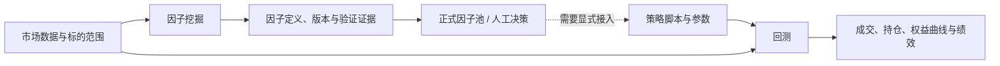

# 量化：回测与因子挖掘

这个目录解释 RICH 的两条量化研究链路：回测回答“一个策略在明确的历史假设下会如何运行”；因子挖掘回答“一个候选信号是否有足够、可追溯的样本外证据，值得进入正式因子池”。它们应当共同服务于研究决策，但不是同一个模块。

图中的虚线是刻意保留的边界：因子入池不等于已经组成组合或自动交易。要把信号变成策略，还要明确排序/预测目标、组合构建、调仓、成本、风险约束和执行方式；这些假设应在回测里单独验证。

## 从哪里开始读

- [[投资/投资平台/量化/回测模块|回测模块]]：策略接口、数据预热、标的选择、撮合记账、结果与回测/Paper/Live 的边界。
- [[投资/投资平台/量化/因子挖掘模块|因子挖掘模块]]：因子版本、候选生成、前视审计、样本外验证、统计门控与入池审批。

## 两条链路各自不能替代什么

| 模块 | 能回答 | 不能单独证明 |
| --- | --- | --- |
| 因子挖掘 | 信号在预先定义的样本、范围和门槛下是否留下可复现的统计证据 | 最终组合在成本、容量、调仓和执行限制下仍然可交易 |
| 回测 | 一个具体策略、仓位和交易规则在历史模拟中的结果 | 策略没有数据泄漏、幸存者偏差、过拟合或未来执行偏差 |

因此正常顺序不是“挖到高分因子就实盘”，而是：先让数据时点和因子定义可复现，再将信号明确接入策略，最后以独立回测、Paper 和小规模实盘逐层验证。

## 文档边界

本文只陈述当前代码可确认的结构，不把项目旧文档、测试名称或目录规模当作运行证明。实际绩效、数据覆盖、交易所限制和实盘可用性需要在对应环境中另行验证。
