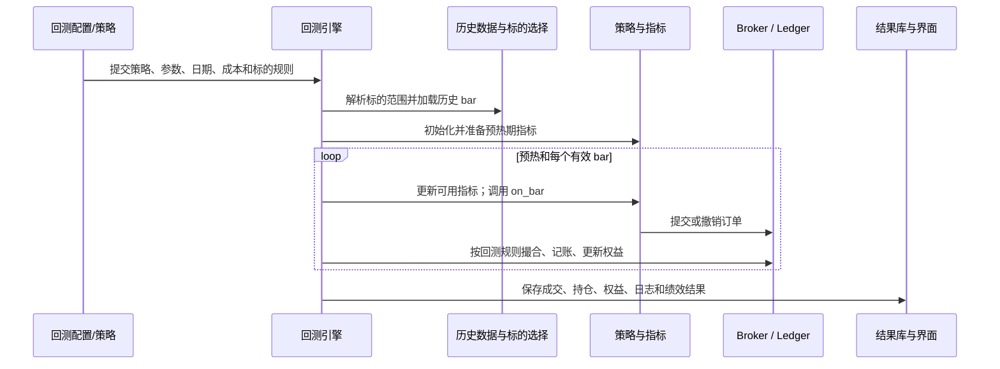

# 回测模块

回测模块把“策略在每根历史 bar 上要做什么”变成一套可检查的模拟：先确定数据与标的范围，再让策略产生订单，由撮合和账本更新持仓与现金，最后输出权益、成交和风险指标。它的价值不在于给出一个收益数字，而在于把每个假设——数据、成本、调仓、持仓和指标预热——都显式化。

## 一次回测由什么构成

| 部分 | 当前职责 |
| --- | --- |
| 策略 | 按统一生命周期声明配置、准备/更新指标，并在 bar 到达时提交订单 |
| 运行时 | 提供上下文、历史数据、指标、组合状态及下单接口 |
| 数据与标的选择 | 按时间范围、周期、复权口径和标的/选股规则读取历史 bar；可配置静态或再平衡标的范围 |
| 回测适配器 | 处理订单、成交、现金、持仓、交易记录、权益曲线和进度 |
| 结果层 | 持久化运行结果，提供详情、图表和多次结果比较 |

策略遵循的核心生命周期是 `initialize`、`prepare_indicators`、`update_indicators`、`on_bar`、`on_order`、`on_trade`。其中 `initialize` 可声明运行配置；`on_bar` 才是每根 bar 的交易决策入口。

## 数据到结果的运行链路

引擎支持策略声明自身的标的、周期、日期、初始资金和费用；表单/外部配置在策略没有声明时作为回退。标的既可以固定，也可以按日、周或月再平衡。动态标的变化会形成一条标的时间线，并可在标的退出时平仓；因此它的正确性取决于选股数据在当时是否可得，而不仅是选股公式本身。

## 预热与因果性是回测可信度的关键

指标通常需要回看窗口。回测会在正式开始日之前加载预热 bar，并将预热期与有效交易期区分开来；预热期产生的订单不会成为正式交易。若历史不够，或没有可解析的开始日，系统会记录预热不足/未启用的警告。

对同时实现 `prepare_indicators` 与 `update_indicators` 的策略，指标准备只接收因果的预热数据，随后每根有效 bar 再更新，以保持与 Paper/Live 的数据可见性一致。旧式“只预计算、不逐 bar 更新”的策略仍可能看到完整历史，运行时会标出未来数据泄漏风险；这类回测结果不应直接与实盘可复现性画等号。

## 撮合、账本与结果

回测引擎将账户状态拆分为订单/撮合与账本两部分：订单可提交或撤销，成交会更新现金、持仓、交易记录和权益曲线。手续费、滑点和卖出印花税都是配置项；没有设置并不代表真实市场成本为零。

结果会包含组合快照、持仓、实际成交、权益曲线和运行日志，并计算诸如夏普、最大回撤、胜率等绩效信息。结果比较适合回答“在相同口径下哪个版本更好”，不适合绕过样本外检验或交易成本来证明策略有效。

## 回测、Paper 与 Live：接口统一，不代表结果等价

策略上下文通过数据、Broker、组合等端口与运行模式解耦，因此同一策略可以接到回测、Paper 和 Live 适配器。这个设计降低了迁移成本，但三者仍有根本差异：

- 回测使用历史数据与模拟撮合；
- Paper 使用实时/准实时数据与模拟账本；
- Live 还受交易所规则、延迟、限频、订单拒绝、实际流动性和风控开关约束。

所以应把链路看作“历史假设 → Paper 行为 → 小额实盘执行”的逐层验证，而不是把回测的权益曲线直接外推为未来收益。

## 回测前的最小检查清单

- 标的范围、上市/退市处理和调仓时点是否为当时可获得的信息？
- 数据周期、复权/价格口径、日期范围和缺失值处理是否固定？
- 手续费、滑点、印花税、最小交易单位和成交规则是否贴近目标市场？
- 指标预热是否足够，且策略没有通过预计算接触未来 bar？
- 结果是否在独立时间段、不同市场状态和合理的参数扰动下仍成立？

回到 [[投资/投资平台/量化/README|量化总览]]。
