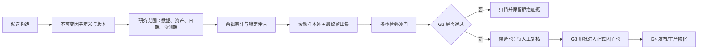

# 因子挖掘模块

因子挖掘模块不是“批量生成公式然后挑最高分”的工具，而是一套研究资产治理流程：保存不可变的因子定义，在明确数据范围内评估，保留前视审计和样本外证据，再把通过统计门控的候选交给正式入池审批。目标是让未来能回答：这个因子当时是什么、在什么数据上评估、为什么被接受或拒绝。

## 因子的两层对象：定义与研究运行

因子定义保存公式/管线、原子输入、家族、回看期、预测期和适用性等内容，并通过参数哈希形成版本。相同定义复用同一版本；定义发生变化则形成新版本，而不是覆盖旧结果。

研究运行不再修改定义，而是在启动时把这个固定版本叠加到研究范围：数据集、资产集合、日期、持有期、可用字段和频率。启动前会检查定义的适用性；缺少必要字段会阻止运行，警告状态则会留下接受警告的事件记录。

## 可以怎样构造候选

当前定义层支持 `formula`、`pipeline`、`gp`、`alphagen` 与 `ml` 等构造方法。它们的共同要求不是“形式相同”，而是都要落到可识别的版本与可复现实验范围。

其中 pipeline 不是自由文本步骤，而是受约束的步骤图：声明输入字段、顺序依赖、运算类型和输出映射；生产重放使用同一因子计算原语。现有生产管线要求 OHLCV 基本字段，并校验每一步是否由受支持的实现执行。这个限制的意义是让研究期的因子值能在生产数据面板上被重复计算，而不是只在某个临时脚本环境里有效。

## 评估时实际在检验什么

锁定评估会先固定因子版本与研究范围，再构造滚动样本外折和一个最终留出窗口。横截面评估在同一天内对齐因子与未来收益，计算 Rank IC，并以高、低分组的收益差作为多空收益代理；成本会从该收益序列中扣除。

通过基础样本外检查后，系统还会将候选置于它所属的搜索/公式族中处理多重检验问题。当前证据记录包括最终留出集、滚动样本外、Romano-Wolf 调整、DSR、PBO、SPA、q 值以及新的因子 t 统计等。只有在相应证据未被跳过、硬门判定通过且达到 G2“多重检验硬门”后，候选才会成为可复核对象；否则会归档，并留下原因码和所用门槛。

这比“单因子 IC 高于阈值”严格得多：它试图防止在大量公式中反复搜索后，把偶然最优误认为有效信号。但统计门控降低风险，不会消除数据质量、制度变化和研究者自由度带来的过拟合。

## 前视审计与时间点

模块会对因子值做前缀重算：对某个日期 (t)，只使用截至 (t) 的数据重算，再与全样本计算出的该日值比较；两者不一致意味着可能依赖未来数据或存在非因果对齐。对只由当期、已审计原子因子构成且不含窗口/未来算子的符号因子，可以采用结构性 PIT 验证；一旦 GP 算子集含滚动、延迟、居中或其他窗口性算子，就会回退到实际前缀重算。

这项审计检查的是“因子值在当时能否计算”，而不是自动保证标的池、标签、成本或交易执行也没有未来函数。那些仍需在数据层、回测层和研究流程中分别约束。

## 入池不是自动发布

G3 是人工/流程审批进入正式因子池的关口。审批会检查候选状态、G2 以上的评估结果和所需统计证据；批准、拒绝、暂不动作及撤销批准都会留下决策和生命周期记录。正式池中的因子仍需要明确它服务的范围与预测期。

G4 才对应发布/生产阶段。特别是 ML 合成信号，除了自身的样本外指标和模型产物，还需要组合回测类证据才具备晋升条件。无论哪一种构造方法，入池或发布都不等于已经产生交易策略：因子如何标准化、组合、调仓和执行，必须在 [[投资/投资平台/量化/回测模块|回测模块]] 中作为独立假设继续验证。

## 研究时优先问的问题

- 这个因子版本的输入字段、资产范围、频率和预测期是否被固定并可复现？
- 它的值在每个交易时点是否可得，标的选择是否也遵守同一时点约束？
- 分割是否区分开发、滚动验证与最终留出集？最终留出集是否只在规定关口被触碰？
- 它属于多少次搜索尝试中的一个，族级多重检验的试验数是否可信？
- 即使通过 G2，接入组合后在成本、换手、容量和市场状态变化下是否仍有价值？

回到 [[投资/投资平台/量化/README|量化总览]]。
